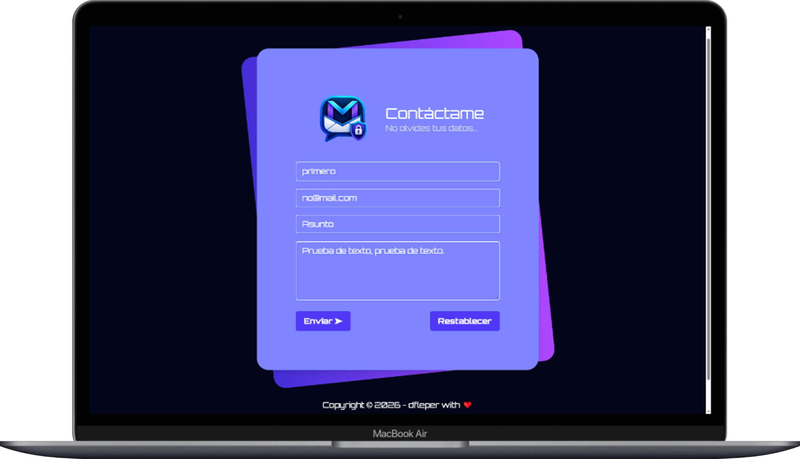
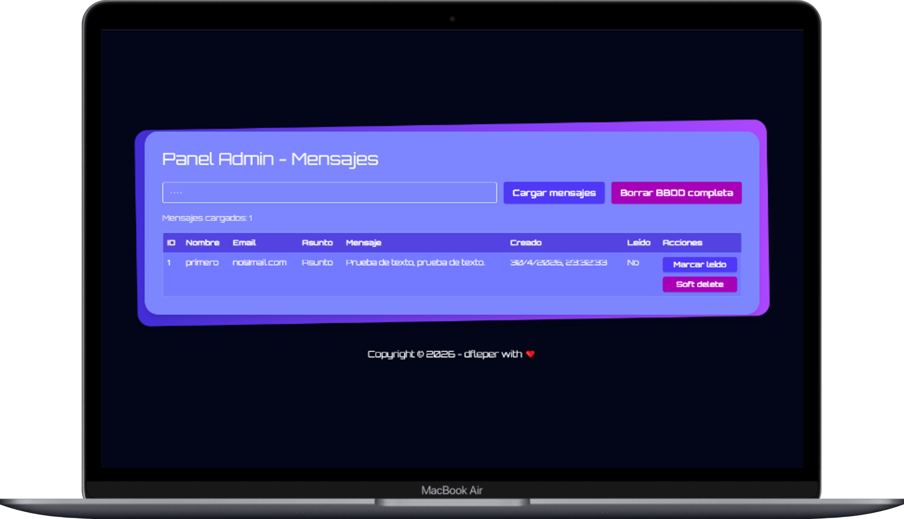
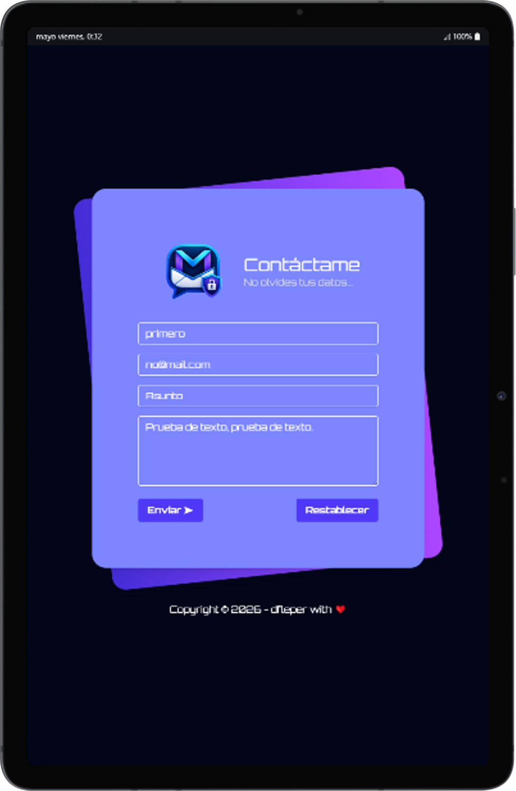
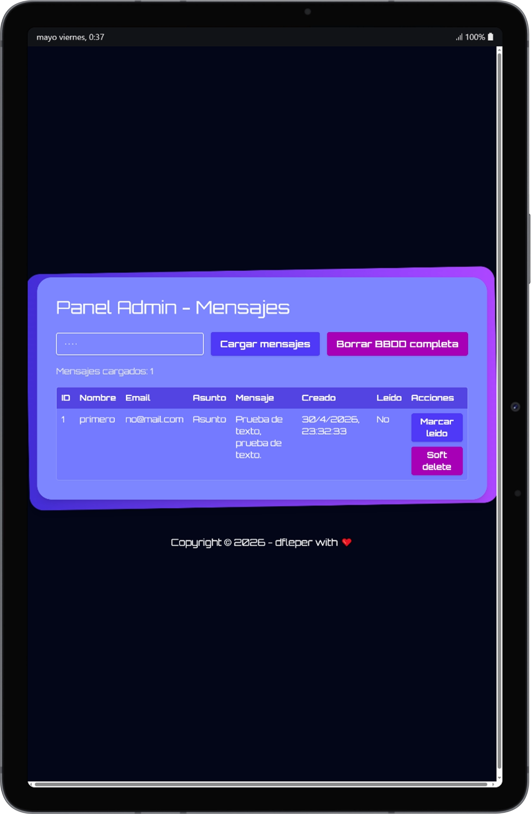

 
 
 
<div style="display: flex; align-items: center; gap: 12px;">
   
</div>

# MessApp (Frontend + Backend)

Proyecto fullstack para envío y gestión de mensajes:

- **Frontend**: Vite (puerto `5173`)
- **Backend**: ASP.NET Core Web API (puerto `5000`)
- **Base de datos**: PostgreSQL 16 (puerto `5432`)

---

## Tecnologías usadas

### Frontend
- JavaScript (ES Modules)
- Vite `8.0.10`
- Tailwind CSS `4.2.4`
- `@tailwindcss/vite` `4.2.4`
- Node.js (imagen Docker `node:lts-alpine3.23`)

### Backend
- C# / .NET 8 (ASP.NET Core Web API)
- Swagger / OpenAPI (`Swashbuckle.AspNetCore`)
- PostgreSQL con provider `Npgsql`
- PostgreSQL (imagen Docker `postgres:16-alpine`)
- SDK de compilación Docker: `mcr.microsoft.com/dotnet/sdk:8.0`

---

## Screenshots

### Tablet View

<div style="display: flex; gap: 12px; justify-content: center; margin-bottom: 12px;">
  
  
</div>

---

### Desktop View

<div style="display: flex; gap: 16px; justify-content: center; margin-bottom: 12px;">
  
  
</div>

---

### Mobile View

<div style="display: flex; gap: 12px; justify-content: center; margin-bottom: 12px;">
  
</div>

---

## 1) Estructura del proyecto

```bash
MessApp/
├── frontend/
│   ├── docker-compose.yml
│   └── ...
└── backend/
    ├── docker-compose.yml
    ├── db/init.sql
    └── ...
```

---

## 2) Requisitos

- Docker
- Docker Compose (plugin `docker compose`)

---

## 3) Levantar Backend + PostgreSQL

Desde la raíz del repo:

```bash
cd backend
docker compose up --build -d
```

Servicios:

- API: `http://localhost:5000`
- Healthcheck API: `http://localhost:5000/health`
- PostgreSQL: `localhost:5432`
  - user: `postgres`
  - password: `postgres`
  - database: `mensajes`

Ver logs:

```bash
docker compose logs -f backend
docker compose logs -f db
```

Parar servicios:

```bash
docker compose down
```

Parar y borrar volúmenes:

```bash
docker compose down -v
```

---

## 4) Levantar Frontend

En otra terminal, desde la raíz del repo:

```bash
cd frontend
docker compose up --build -d
```

Accesos:

- Frontend público: `http://localhost:5173`
- Panel admin: `http://localhost:5173/admin.html`

Ver logs:

```bash
docker compose logs -f frontend
```

Parar servicios:

```bash
docker compose down
```

Parar y borrar volúmenes:

```bash
docker compose down -v
```

---

## 5) Flujo recomendado de arranque (copiar y pegar)

```bash
# 1) backend + db
cd backend
docker compose up --build -d

# 2) frontend
cd ../frontend
docker compose up --build -d

# 3) comprobar API
curl -i http://localhost:5000/health
```

---

## 6) Comandos Docker útiles

### Estado de contenedores

```bash
docker ps
```

### Reiniciar backend

```bash
docker restart mensajes_backend_dev
```

### Reiniciar frontend

```bash
docker restart mensajes_frontend_dev
```

### Reiniciar postgres

```bash
docker restart mensajes_postgres_dev
```

### Entrar al contenedor de backend

```bash
docker exec -it mensajes_backend_dev sh
```

### Entrar al contenedor de postgres

```bash
docker exec -it mensajes_postgres_dev sh
```

---

## 7) Comando para truncar tabla `mensajes` (solicitado)

> Ejecuta este comando exactamente así:

```bash
docker exec -it mensajes_postgres_dev psql -U postgres -d mensajes -c "TRUNCATE TABLE mensajes RESTART IDENTITY CASCADE;"
```

---

## 8) Endpoints principales del backend

### Público

- `POST /api/mensajes`
- `GET /health`

### Admin (requiere header `X-Admin-Key`)

- `GET /api/mensajes/admin?limit={n}`
- `PATCH /api/mensajes/admin/{id}/read`
- `DELETE /api/mensajes/admin/{id}`
- `DELETE /api/mensajes/admin/purge`

En desarrollo, el `docker-compose` del backend define la API key en:

- `AdminAccess__ApiKey=1234`

---

## 9) Solución rápida de problemas

### El frontend no conecta con backend

1. Verifica que backend esté arriba:

```bash
docker ps
```

2. Revisa health:

```bash
curl -i http://localhost:5000/health
```

3. Verifica que frontend use `VITE_API_URL=http://localhost:5000` (ya viene en `frontend/docker-compose.yml`).

### Error de base de datos

```bash
cd backend
docker compose logs -f db
```

Si necesitas reiniciar desde cero:

```bash
cd backend
docker compose down -v
docker compose up --build -d
```

---

## 10) Apagado completo del entorno

```bash
cd backend
docker compose down
cd ../frontend
docker compose down
```

Con limpieza de volúmenes:

```bash
cd backend
docker compose down -v
cd ../frontend
docker compose down -v
```